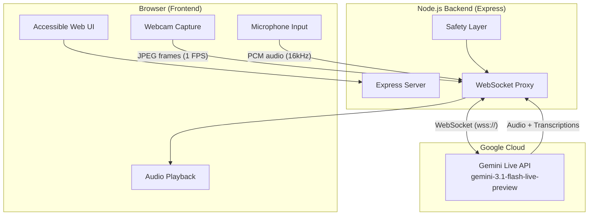

# TruthLens VisionGuide — Implementation Plan

Build an AI-powered blind navigation & environmental assistance system using the Gemini Live API for real-time multimodal scene understanding and voice guidance.

> [!IMPORTANT]
> **Phased Approach**: Each phase will be built, tested, and approved by you before moving to the next. No phase will begin without your explicit confirmation.

---

## Architecture Overview



---

## Technology Stack

| Layer | Technology | Rationale |
|---|---|---|
| **Frontend** | Vanilla HTML/CSS/JS | Simple, accessible, no build tools needed |
| **Backend** | Node.js + Express | WebSocket proxy, secure API key handling |
| **AI** | Gemini Live API (`gemini-3.1-flash-live-preview`) | Real-time multimodal, native audio output |
| **Communication** | WebSocket (browser ↔ server ↔ Gemini) | Low-latency bidirectional streaming |
| **Audio** | Web Audio API + PCM processing | Raw audio capture and playback in browser |
| **Video** | MediaDevices API + Canvas | Webcam capture and JPEG frame extraction |

---

## Phase Breakdown

We will build this system in **5 phases**. Each phase produces a working, testable result.

---

## Phase 1 — Project Foundation & Hardware Verification

**Goal**: Set up the project skeleton, verify webcam/microphone/speaker work in the browser, and display a beautiful accessible UI.

### What you'll get at the end
A running web app that opens your webcam, captures microphone audio, plays a test tone through speakers, and confirms all hardware is ready — with a polished dark-mode accessible UI.

### Proposed Changes

#### [NEW] `package.json`
- Node.js project configuration with Express, dotenv, ws dependencies
- Scripts: `dev` (start development server)

#### [NEW] `.env.example`
- Template for `GEMINI_API_KEY` environment variable

#### [NEW] `server.js`
- Express server serving static files from `public/`
- Listens on configurable port (default 3000)
- Basic health check endpoint

#### [NEW] `public/index.html`
- Accessible, semantic HTML structure
- Single `<h1>`, proper heading hierarchy
- Webcam video preview, audio visualizer area
- Hardware status indicators (camera, mic, speaker)
- Large, accessible buttons with ARIA labels
- Meta tags for SEO

#### [NEW] `public/css/index.css`
- Dark mode design system with CSS custom properties
- Glassmorphism panels, smooth gradients
- Accessible color contrast (WCAG AA minimum)
- Responsive layout, large touch targets
- Micro-animations and hover effects
- Status indicator styles (green/red/amber pulse)

#### [NEW] `public/js/hardware.js`
- Webcam access via `navigator.mediaDevices.getUserMedia()`
- Microphone access and audio level visualization
- Speaker test via Web Audio API oscillator
- Hardware capability detection and status reporting
- Permission error handling with user-friendly messages

#### [NEW] `public/js/app.js`
- Main application orchestrator
- Initializes hardware checks on page load
- Updates UI status indicators
- Event listeners for user interactions

> [!NOTE]
> **Static Assets**: The UI will use CSS-only design elements (gradients, shapes, borders) instead of image assets. If you want a logo or specific icons, please place them in `public/assets/` and let me know the filenames.

---

## Phase 2 — Gemini Live API Connection & Text Interaction

**Goal**: Establish a working WebSocket connection to Gemini Live API through the Node.js backend proxy, and enable text-based conversation.

### What you'll get at the end
Type a question in the UI → it goes to Gemini via WebSocket → you receive a text response displayed on screen. This validates the full communication pipeline before adding audio/video.

### Proposed Changes

#### [MODIFY] `server.js`
- Add WebSocket server (ws library) for browser ↔ server communication
- Establish raw WebSocket to Gemini Live API endpoint (`wss://generativelanguage.googleapis.com/...`)
- Send `BidiGenerateContentSetup` config message on connection
- Proxy messages between browser and Gemini
- System instruction: blind navigation assistant persona

#### [MODIFY] `public/index.html`
- Add text input area and message display panel
- Add connection status indicator
- Add conversation transcript area

#### [NEW] `public/js/gemini-client.js`
- Browser WebSocket client connecting to local server
- Send text messages to Gemini via server proxy
- Receive and parse server messages (text transcriptions)
- Connection lifecycle management (connect/disconnect/reconnect)

#### [MODIFY] `public/css/index.css`
- Chat/transcript panel styles
- Connection status styles
- Message bubble styles

---

## Phase 3 — Voice Input & Audio Output (Full Multimodal Voice)

**Goal**: Enable real-time voice conversation with Gemini. Speak into the microphone → Gemini responds with spoken audio.

### What you'll get at the end
A fully voice-interactive system: speak naturally, hear Gemini's spoken responses. Input/output transcriptions displayed in real-time.

### Proposed Changes

#### [NEW] `public/js/audio-handler.js`
- Capture microphone as raw PCM (16-bit, 16kHz, little-endian) using AudioWorklet
- Stream PCM chunks to server via WebSocket
- Receive audio response chunks (PCM 24kHz) from server
- Audio playback using Web Audio API (AudioBuffer queue)
- Barge-in support (stop playback when user speaks)

#### [NEW] `public/js/audio-worklet-processor.js`
- AudioWorklet processor for real-time PCM conversion
- Downsample browser's native sample rate (usually 48kHz) to 16kHz
- Convert Float32 to Int16 PCM format
- Buffer and emit chunks at appropriate intervals

#### [MODIFY] `server.js`
- Route audio data from browser to Gemini as `realtimeInput.audio`
- Route audio responses from Gemini back to browser
- Handle input/output transcriptions
- Configure Gemini for `responseModalities: ["AUDIO"]`
- Enable input/output transcription in config

#### [MODIFY] `public/index.html`
- Add mic toggle button (push-to-talk or always-on toggle)
- Add audio visualizer (input & output levels)
- Add transcription display area (live captions)

#### [MODIFY] `public/js/app.js`
- Integrate audio handler with UI controls
- Manage mic state (active/muted)
- Display live transcriptions

#### [MODIFY] `public/css/index.css`
- Audio visualizer animation styles
- Mic active/muted states
- Live caption styles

---

## Phase 4 — Camera Integration & Scene Understanding

**Goal**: Send webcam frames to Gemini for real-time scene understanding. The AI can now "see" and describe the environment.

### What you'll get at the end
Point your webcam at something → ask "What do you see?" → Gemini describes the scene through spoken audio. Continuous frame streaming at ~1 FPS.

### Proposed Changes

#### [NEW] `public/js/camera-handler.js`
- Capture webcam frames using Canvas API
- Convert to JPEG at configurable quality (0.5-0.8 for bandwidth)
- Stream frames at 1 FPS (configurable) to server via WebSocket
- Frame capture toggle (start/stop)
- Resolution management (target 640x480 for efficiency)

#### [MODIFY] `server.js`
- Route video frames from browser to Gemini as `realtimeInput.video`
- Update system instruction with navigation-specific guidance:
  - Describe obstacles, pathways, doors, stairs
  - Give directional cues (left, right, ahead, behind)
  - Prioritize safety warnings
  - Keep responses short and actionable

#### [MODIFY] `public/index.html`
- Camera preview area (can be hidden for accessibility, but useful for testing)
- Camera toggle control
- Frame rate indicator

#### [MODIFY] `public/js/app.js`
- Integrate camera handler
- Coordinate camera + audio + Gemini session
- Camera enable/disable controls

#### [MODIFY] `public/css/index.css`
- Camera preview styles
- Frame rate indicator styles

---

## Phase 5 — Safety Layer & Assistive Navigation Logic

**Goal**: Add the safety-critical layer that makes this genuinely useful for blind users — failure handling, emergency warnings, uncertainty fallback, and refined navigation prompts.

### What you'll get at the end
A production-ready assistive prototype with safety fallbacks, emergency stop, connection loss handling, and polished navigation guidance.

### Proposed Changes

#### [NEW] `public/js/safety.js`
- Connection health monitoring (heartbeat/ping)
- Timeout detection (no AI response within N seconds)
- Emergency fallback: spoken "Please stop. Connection lost." via browser Speech Synthesis
- Uncertainty detection in AI responses
- User-controlled emergency stop button
- Auto-reconnect with exponential backoff
- Offline fallback mode (basic TTS warnings)

#### [MODIFY] `server.js`
- Enhanced system instruction with safety rules:
  - "If uncertain, say 'I'm not confident about what I see. Please stop and check manually.'"
  - "Never give directions you're not sure about."
  - "Prioritize obstacle warnings over descriptions."
  - "If asked about safety, err on the side of caution."
- WebSocket connection health monitoring
- Graceful error handling and session recovery
- Rate limiting and frame throttling

#### [MODIFY] `public/index.html`
- Emergency stop button (large, always visible, keyboard accessible)
- Connection health indicator
- Safety status area

#### [MODIFY] `public/js/app.js`
- Integrate safety layer with all components
- Keyboard shortcuts (Space = emergency stop, M = mute/unmute)
- Screen reader announcements for status changes
- Full keyboard navigation support

#### [MODIFY] `public/css/index.css`
- Emergency stop button styles (large, high-contrast red)
- Safety alert styles
- Connection health indicator animations

---

## User Review Required

> [!IMPORTANT]
> **API Key**: You will need a Google Gemini API key. You can get one free from [Google AI Studio](https://aistudio.google.com/apikey). Please have this ready before Phase 2.

> [!IMPORTANT]
> **Hardware Requirements**: For testing you'll need:
> - A webcam (built-in laptop camera works)
> - A microphone (built-in laptop mic works)
> - Speakers or headphones
> - Chrome or Edge browser (recommended for Web Audio API support)

> [!WARNING]
> **Safety Disclaimer**: This is a prototype. Even after Phase 5, the system should NOT be relied upon as a sole navigation tool. Always use traditional mobility aids alongside this system.

---

## Open Questions

1. **Language**: The product doc mentions Hindi/English bilingual support. Should Phase 3 voice interaction support both languages from the start, or English first with Hindi added later?

2. **Always-on vs Push-to-talk**: For voice input, do you prefer:
   - **Always-on** (continuous listening, hands-free) — better for real navigation
   - **Push-to-talk** (press button to speak) — easier for initial testing

3. **Static Assets**: Do you have a logo or brand imagery you'd like to use? If so, please place them in `public/assets/` with descriptive filenames (e.g., `logo.png`, `icon.svg`). Otherwise I'll use CSS-only branding.

---

## Verification Plan

### Each Phase
- Run the dev server (`npm run dev`)
- Open in browser and manually test all features
- Verify console has no errors
- Test with keyboard-only navigation

### Phase-Specific Tests
| Phase | Test |
|---|---|
| 1 | Camera preview shows, mic level indicator moves, test tone plays |
| 2 | Text message sent → text response received and displayed |
| 3 | Speak → hear Gemini's spoken response, see live transcription |
| 4 | Point camera → ask "What do you see?" → get accurate scene description |
| 5 | Disconnect WiFi → hear safety fallback message, emergency stop works |

---

## Project Structure (Final)

```
source code/
├── product_details.md
├── package.json
├── .env.example
├── .env                    (your API key — gitignored)
├── server.js               (Express + WebSocket proxy)
└── public/
    ├── index.html           (accessible UI)
    ├── css/
    │   └── index.css        (design system)
    └── js/
        ├── app.js           (main orchestrator)
        ├── hardware.js      (device detection)
        ├── gemini-client.js (WebSocket client)
        ├── audio-handler.js (PCM capture/playback)
        ├── audio-worklet-processor.js (AudioWorklet)
        ├── camera-handler.js(frame capture)
        └── safety.js        (fallback & safety)
```
